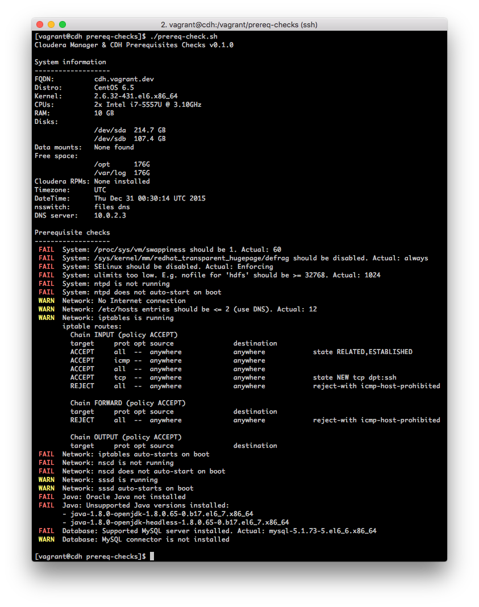
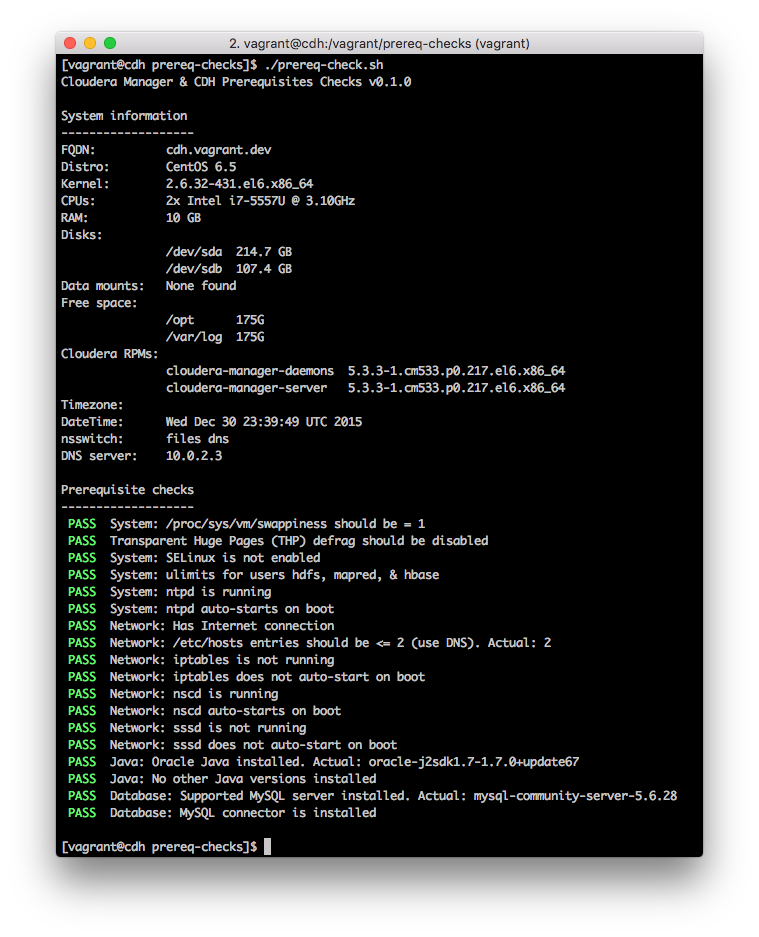

# CM & CDH Prerequisites Checker

[](https://travis-ci.org/cloudera-ps/prereq-checks)

Bash script for displaying relevant system information and performing
prerequisite checks for Cloudera Manager & CDH installation.

**Motivation**: Ensuring that the long list of required and recommended
prerequisites are correctly applied during a [Hadoop Cluster
Deployment](http://www.cloudera.com/content/www/en-us/services-support/professional-services/cluster-certification.html)
(or similar) engagement is manual, time-consuming, and error-prone (not to
mention mind-numbing).

**Non-Goals**: This is not intended to replace or compete with the
[Cloudera Support Interface (CSI)](http://blog.cloudera.com/blog/2014/02/secrets-of-cloudera-support-inside-our-own-enterprise-data-hub/),
which includes a detailed cluster validation report.

For details on the checks performed, refer to the following:
- [Installation requirements for Cloudera Manager & CDH](http://www.cloudera.com/content/www/en-us/documentation/enterprise/latest/topics/installation_reqts.html)
- [Optimizing Performance in CDH](http://www.cloudera.com/content/www/en-us/documentation/enterprise/latest/topics/cdh_admin_performance.html)

## Sample output

The following screenshot shows a run on an configured (or misconfigured)
system:


And here's the output on the same server after addressing all the issues:


# How to run this checker

Currently there are two ways to run this script:
The first method is to obtain the inspection result from a single host targeting
the host that executed the script.
The second method is to obtain the inspection results from multiple hosts
by using [Ansible](https://www.ansible.com/) to automate distribution and
execution of the script file(s) and gathering the inspection results from
the multiple target hosts.

## Prerequisites
1. For using the distributed mode, run
`    yum install ansible`
2. For using the AD domain controller checks, run
`    yum install perl-Convert-ASN1 bind-utils`
3. For using the AD delegated user privilege checks, run
`    yum install openldap-clients`

## Running it

Running the script is easy as it is intentionally written in Bash to avoid any
dependencies. This is to avoid dependency hell in restrictive customer
environments. It does not run on Mac OS. Tested on RHEL/CentOS 6.7 and 7.3 - see
the [vagrant/](vagrant/) subfolder for details. Requires root/superuser
permissions to run.

### Option A - Dev version

To run:

    ./prereq-check-dev.sh

This requires the libraries in `lib/`, which includes both Bash and Perl
libraries. See Usage for details.

### Option B - Single file version

To build/update the single file version of the script, run:

    ./build.sh

This produces the file `prereq-check.sh`. See Usage for details.

Usage for `build.sh`:

```
% ./build.sh -h
NAME:
  build.sh - prereq-check.sh build script

SYNOPSIS:
  build.sh [options]

OPTIONS:
  -h, --help
    Show this message

  -a, --auto-build
    Watch dependencies for changes and automatically rebuild on changes
```

With the `-a` option, the build script can watch dependencies and automatically
rebuild the combined `prereq-check.sh`. It also runs `shellcheck` (Bash Lint) if
it's installed. For example:

```
% ./build.sh -a
Sun Aug 20 11:21:19 SGT 2017 [INFO] Found 'shellcheck', will run post-build Bash lint
Sun Aug 20 11:21:19 SGT 2017 [INFO] Watching dependencies for changes...
Sun Aug 20 11:21:32 SGT 2017 [INFO] Wrote to prereq-check.sh and updated Vagrant hard-links
Sun Aug 20 11:21:32 SGT 2017 [INFO] Running 'shellcheck prereq-check.sh'...
Sun Aug 20 11:21:33 SGT 2017 [INFO] shellcheck: All good
Sun Aug 20 11:21:41 SGT 2017 [INFO] Wrote to prereq-check.sh and updated Vagrant hard-links
Sun Aug 20 11:21:41 SGT 2017 [INFO] Running 'shellcheck prereq-check.sh'...

In prereq-check.sh line 1434:
unused_var=
^-- SC2034: unused_var appears unused. Verify it or export it.

Sun Aug 20 11:21:42 SGT 2017 [INFO] shellcheck: Found above warnings/errors
```

## Usage

```
$ ./prereq-check.sh -h
NAME:
  prereq-check.sh - Cloudera Manager & CDH Prerequisites Checks v1.4.1

SYNOPSIS:
  prereq-check.sh [options]

OPTIONS:
  -h, --help
    Show this message

  -a, --addc domain
    Run tests against Active Directory Domain Controller

  -p, --privilegetest ldapURI binddn searchbase bind_user_password
    Run tests against Active Directory delegated user for Direct to AD integration
    http://blog.cloudera.com/blog/2014/07/new-in-cloudera-manager-5-1-direct-active-directory-integration-for-kerberos-authentication/

  -c, --cdsw CDSW_FQDN CDSW_Master_IP
    Run CDSW pre-requisite checks
```

## Contributions

Please report any bugs or feature requests using the Github Issues here. Better
yet, send pull requests!
